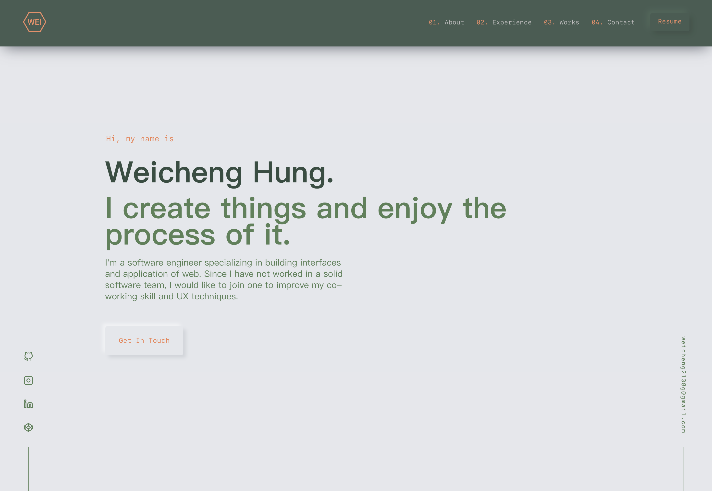

# porfolio-nuxt-neu

<p align="center">
    <a href="https://weichenghung.com" target="_blank">
        weichenghung.com
    </a>
</p>

<p align="center">
    <a href="https://app.netlify.com/sites/elated-payne-b4209a/deploys" target="_blank">
        
    </a>
</p>



This is a porfolio practice which consider [brittanychiang.com](https://brittanychiang.com) as my reference. My purpose is to reverse engineer her site and use the same appearance. One of goal is transforming [Gatsby](https://www.gatsbyjs.org/docs/) to [Nuxt](https://nuxtjs.org/) by using different front-end framework to do the job. This is simply for practice.

## Survey and Preparation

1. Tips of Nuxt

    - Enter point of the project: layouts/default.vue => pages/index.vue. Then you can break down from those components and pages.
    - asyncData() can not be used in components, components take only pure vue stuff.
    - Normal spa mode will load empty dom, but not universal mode (SSR). SSR web will load dom at the beginning. SSR will evalute the vue component in the server (SEO purpose for existing DOM). After the first load (refresh), it will run on client side (Turn to be SPA), including nuxt-link and router.
    - Components in folder where you put your section in will auto import with the proper name in template such as components/sections/comp.vue => <SectionsComp />

## Build Setup

```bash
# install dependencies
$ yarn install

# serve with hot reload at localhost:3000
$ yarn dev

# build for production and launch server
$ yarn build
$ yarn start

# generate static project
$ yarn generate
```

For detailed explanation on how things work, check out [Nuxt.js docs](https://nuxtjs.org).
